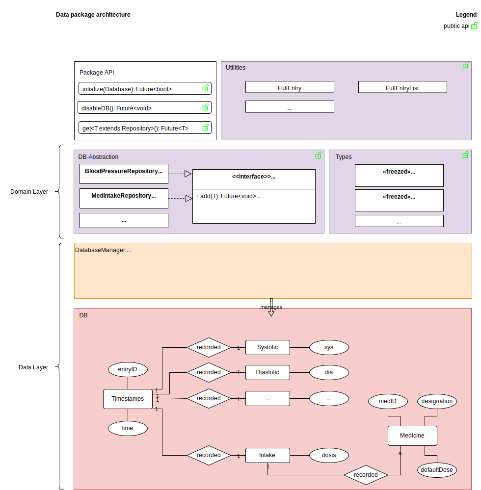

*developer documentation - users can safely ignore this*

User data is stored in a designated database that is accessed through a minimal CRUD API. This aims to reduce the risk of data loss. The general idea is described by this diagram:



## Package guide

The primary organisational unit is the Repository, which abstracts away a table in the db. To prevent accidental misuse, only the class signature is exposed beyond the package. The actual implementation is package private and instantiated through the HealthDataStore class. Here is the general pattern:

### Common API

```repository.dart``` (exported)
```dart
abstract class Repository<T> {
  Future<void> add(T value);
  // ...
}
```

```health_data_store.dart``` (exported)
```dart
class HealthDataStore {
  // ...
  NoteRepository get noteRepo =>
      NoteRepositoryImpl(_dbMngr.db);
}
```

### Feature specific API example
```note_repository.dart``` (exported)
```dart
abstract class NoteRepository extends Repository<Note> { }
```

`note_repository_impl.dart` (private)
```dart
class NoteRepositoryImpl extends NoteRepository {
  @override
  Future<void> add(T value) {
    // ...
  }
  // ...
}
```

## DB management

The database schema is created and updated by a designated DatabaseManager class. By giving this class sole control, the risk of unexpected db state is minimized and updating the scheme becomes easy.

When adding new fields to the db, existing tables can stay untouched and a new type with a designated table can be created. For this type a repository must be implemented like explained above. Should the type need supplementary information, more tables may be created (look at MedicineRepository for reference).

## Full entry

The FullEntry type is a utility type that provides easy handling of record, note and intakes. This is required due to the close coupling of these types in the UI (same list entry, same input form, joint export).

This is no ideal solution as it largely defeats the point of the separation. When possible UI using the data should be designed in a way that doesn't rely on this kind of coupling. 